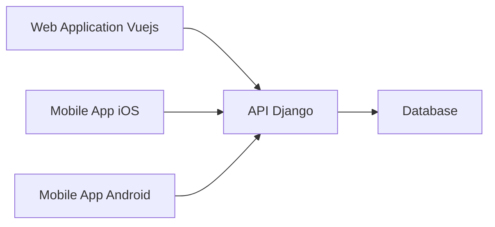

# GreaterWMS Architecture Analysis

The GreaterWMS repository reveals a microservice-like architecture with a clear separation between a backend (Python/Django) and a frontend (Vue.js/Quasar).  However, the implementation shows areas for improvement in terms of modularity, deployment, and scalability.

## Overall System Architecture

GreaterWMS employs a client-server architecture.  The frontend, built using Vue.js and Quasar Framework, handles user interaction and presentation. The backend, implemented with Python and Django, manages business logic, data persistence, and API interactions.  A mobile app (with separate iOS and Android builds) complements the web application, sharing the same backend.

## Component Relationships and Dependencies

* **Frontend (Vue.js/Quasar):**  Responsible for the user interface, handling user input and displaying data received from the backend API.  The `app` directory contains the frontend codebase.
* **Backend (Python/Django):**  Manages business logic, data access, and the RESTful API. The backend code resides in the root directory.
* **Database:**  Stores inventory data, user information, and other relevant information. The specific database technology is not explicitly mentioned in the provided code.
* **Docker:** Used for optional deployment, suggesting a containerized approach. The `Dockerfile` indicates separate images for the frontend and backend.
* **Supervisor:**  Used for process management in the backend deployment (as indicated in the `Dockerfile` and deployment documentation).
* **Nginx:**  Implied as a reverse proxy and load balancer based on the deployment documentation.

## Service Architecture and Modularity

The architecture exhibits a degree of modularity through the separation of frontend and backend. However, internal modularity within the Django backend is not evident from the provided code snippets.  A more granular breakdown of the backend into smaller, independent services would improve maintainability and scalability.

**Recommendation:** Refactor the Django backend into smaller, well-defined services (e.g., inventory management, order management, user management).  This would allow for independent scaling and deployment of individual services.  Consider using a message queue (e.g., RabbitMQ, Kafka) for inter-service communication.

## Data Flow and System Boundaries

Data flows unidirectionally from the backend to the frontend.  The frontend sends requests to the backend API, which processes the requests, accesses the database, and returns the results to the frontend.  The system boundary is well-defined between the frontend and backend, but internal boundaries within the backend need clarification.

**Recommendation:** Clearly define data models and APIs.  Document the data flow within the backend to ensure consistency and prevent data inconsistencies.

## Scalability and Maintainability Considerations

* **Scalability:** The current architecture can scale horizontally by deploying multiple instances of the backend and frontend.  However, the lack of internal modularity within the backend limits scalability.
* **Maintainability:** The separation of frontend and backend improves maintainability.  However, the lack of detailed documentation and potentially monolithic backend structure hinders maintainability.

**Recommendations:**

* **Backend Refactoring:**  Break down the monolithic backend into microservices.
* **API Documentation:**  Generate comprehensive API documentation (e.g., using Swagger/OpenAPI).
* **Automated Testing:** Implement comprehensive unit, integration, and end-to-end tests.
* **Continuous Integration/Continuous Deployment (CI/CD):** Set up a CI/CD pipeline to automate the build, testing, and deployment process.
* **Code Style and Linting:** Enforce consistent code style and linting rules to improve code readability and maintainability.

## Architectural Strengths

* **Clear Separation of Concerns:** The separation of frontend and backend is a significant strength, promoting modularity and maintainability.
* **Use of Docker:** Containerization simplifies deployment and ensures consistency across environments.
* **Multi-Platform Support:** The availability of iOS and Android mobile apps expands the reach of the system.

## Potential Improvements

* **Improved Backend Modularity:**  Refactor the backend into microservices for better scalability and maintainability.
* **Database Choice:** Specify the database technology used and justify the choice based on performance and scalability requirements.
* **Caching Strategy:** Implement a caching strategy to improve performance and reduce database load.
* **Monitoring and Logging:** Integrate monitoring and logging tools to track system performance and identify potential issues.
* **Security Considerations:** Implement robust security measures to protect sensitive data.

This analysis provides a high-level overview of the GreaterWMS architecture. A more in-depth analysis would require access to the complete source code and database schema.