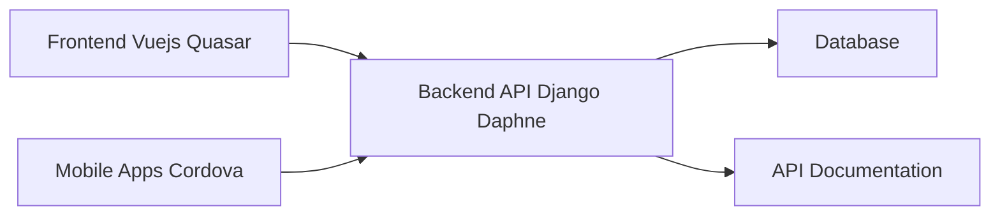

# GreaterWMS Architecture Analysis

This document analyzes the architecture of the GreaterWMS inventory management system based on the provided code snippets.  The system appears to be a three-tier architecture with a frontend, backend, and database (implied).  However, the lack of complete codebase limits the depth of the analysis.

## Overall System Architecture and Design Patterns

GreaterWMS employs a classic three-tier architecture:

1. **Frontend:** A Vue.js based application built using Quasar Framework, responsible for user interaction and presentation.  It's deployed as a web application and also packaged for Android and iOS mobile platforms using Cordova.

2. **Backend:** A Python-based backend built using Django, handling business logic, data processing, and API interactions.  It uses Daphne for asynchronous communication (likely WebSockets for real-time updates).

3. **Database:** The code doesn't explicitly specify the database, but a relational database (like PostgreSQL or MySQL) is likely used given the nature of inventory management.

**Design Patterns:**  Based on the limited code, we can infer the use of:

* **Model-View-Controller (MVC):**  Django inherently follows the MVC pattern, separating concerns between models (data), views (presentation logic), and controllers (business logic).
* **RESTful API:** The backend likely exposes a RESTful API for the frontend to consume, enabling communication between the tiers.

## Component Relationships and Dependencies

* **Frontend (Vue.js, Quasar):**  The frontend is responsible for user interface, data display, and user input. It depends heavily on the backend API for data retrieval and manipulation.
* **Backend API (Django, Daphne):** The Django backend handles business logic, data access, and API requests. It depends on the database for persistent data storage and Daphne for real-time communication.
* **Database:** Stores persistent data for the inventory management system.
* **Mobile Apps (Cordova):**  The mobile apps share the same backend API as the web application.
* **API Documentation:**  Provides documentation for the backend API, crucial for maintainability and integration.

## Service Architecture and Modularity

The system appears to be reasonably modular, with the separation of frontend and backend.  Django's built-in features promote modularity through models, views, and templates. However, the internal structure of the Django application is not visible from the provided code.  Further analysis of the Django project structure would be needed to assess the level of modularity within the backend.

## Data Flow and System Boundaries

The data flow is straightforward:

1. User interacts with the frontend (web or mobile).
2. Frontend sends requests to the backend API.
3. Backend API processes the request, interacts with the database, and returns the response.
4. Frontend displays the response to the user.

System boundaries are clearly defined between the frontend and backend. The API acts as a well-defined interface.

## Scalability and Maintainability Considerations

**Scalability:**

* **Backend:**  Django, with appropriate database configuration and potentially load balancing, can scale horizontally to handle increased traffic.  The use of Daphne suggests consideration for real-time scalability.
* **Database:**  The choice of database and its configuration are critical for scalability.  A well-designed database schema and appropriate database technology are essential.
* **Frontend:**  The frontend, being client-side, can scale relatively easily through content delivery networks (CDNs) for static assets.

**Maintainability:**

* **Modularity:**  The current separation of frontend and backend is a good starting point for maintainability.  However, further internal modularity within the Django application is crucial.
* **API Documentation:**  The presence of API documentation is essential for maintainability.
* **Code Quality:**  Adherence to coding standards and best practices is important for long-term maintainability.  The `.editorconfig` and `.eslintrc.js` files in the frontend suggest an attempt at enforcing code style.

## Recommendations for Architectural Improvements

1. **Detailed Database Design:**  Specify the database technology (e.g., PostgreSQL, MySQL) and provide a detailed schema design.  Consider database normalization to improve data integrity and performance.

2. **Backend Modularization:**  Analyze the Django project structure to ensure proper modularity.  Break down large modules into smaller, more manageable components with clear responsibilities.

3. **Comprehensive Testing:**  Implement comprehensive unit, integration, and end-to-end tests to ensure code quality and prevent regressions.

4. **Deployment Strategy:**  Define a robust deployment strategy, including continuous integration/continuous deployment (CI/CD) pipelines.

5. **Monitoring and Logging:**  Implement monitoring and logging to track system performance, identify bottlenecks, and diagnose issues.

6. **Security Considerations:**  Implement appropriate security measures to protect against common web vulnerabilities (e.g., SQL injection, cross-site scripting).

7. **Containerization:** The use of Docker is a good start, but consider using Docker Compose or Kubernetes for orchestration and management of the application's components.

This analysis provides a high-level overview. A more in-depth analysis would require access to the complete source code and database schema.