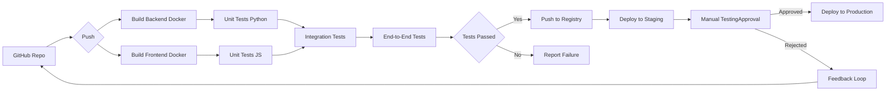

# GreaterWMS Repository CI/CD Analysis

This analysis examines the provided GreaterWMS repository content to assess its current CI/CD practices, identify automation opportunities, and recommend improvements.

## Current CI/CD Pipeline Configuration

The repository shows rudimentary CI/CD elements but lacks a fully defined pipeline.  There's no `.github/workflows` directory indicating the absence of GitHub Actions workflows or any other explicit CI/CD configuration files.  The `Dockerfile` suggests a Docker-based deployment strategy, but the process is not automated.

## Build and Deployment Processes

The build process is partially defined:

* **Backend:** The `Dockerfile` outlines building the backend using a Python 3.8.10 slim image.  Dependencies are installed using `pip`.  A `backend_start.sh` script is used to start the application, likely using `supervisor`.
* **Frontend:** Another `Dockerfile` builds the frontend using a Node.js 14.19.3 slim image.  `npm` and `yarn` are used for dependency management, and `@quasar/cli` is used for building the Quasar application. A `web_start.sh` script handles the frontend startup.

Deployment is manual.  The `README` files describe manual steps for deploying using Docker Compose (`docker-compose up -d`), but there's no automated deployment process.  Manual instructions are also provided for deploying on bare metal (Windows, CentOS, Ubuntu) using `supervisor` and `nginx`.

## Automation Opportunities

Significant automation opportunities exist:

* **Automated Builds:** Integrate a CI system (e.g., GitHub Actions) to automatically build both the backend and frontend Docker images upon code pushes.
* **Automated Testing:** Implement automated unit, integration, and end-to-end tests.  These tests should be run as part of the CI pipeline to ensure code quality.
* **Automated Deployment:** Automate the deployment process using the CI system to push the built Docker images to a container registry (e.g., Docker Hub, Google Container Registry) and deploy them to a staging or production environment.  This could involve using tools like Kubernetes or Docker Swarm.
* **Automated Versioning:** Implement semantic versioning and automatically update the version number in the application and Docker images during the build process.
* **Infrastructure as Code:** Use tools like Terraform or Ansible to manage the infrastructure (servers, networks, etc.) in a declarative manner. This allows for reproducible and consistent deployments.

## Quality Gates and Testing Integration

Currently, there are no explicit quality gates or testing integrations.  The `README` mentions the existence of mobile apps (iOS and Android), but there's no information about their build and testing processes.

Recommendations:

* **Unit Tests:** Implement unit tests for both the backend (Python) and frontend (JavaScript/Vue) codebases.
* **Integration Tests:** Test the interaction between the backend and frontend.
* **End-to-End Tests:**  Automate end-to-end tests to simulate user workflows and verify the overall functionality of the application.
* **Code Coverage:** Measure code coverage to track the effectiveness of the testing efforts.
* **Static Code Analysis:** Integrate tools like ESLint (already present in the frontend) and Pylint (for the backend) to identify potential code issues early in the development process.

## Infrastructure as Code Practices

No Infrastructure as Code (IaC) practices are evident.  The deployment instructions rely on manual configuration of servers.

Recommendations:

* **Adopt IaC:** Use tools like Terraform or Ansible to define and manage the infrastructure.  This will improve consistency, reproducibility, and scalability.
* **Container Orchestration:** Consider using Kubernetes or Docker Swarm to manage the deployment and scaling of the application containers.

## CI/CD Workflow Recommendations

The following diagram illustrates a recommended CI/CD workflow:

## Optimized Deployment Strategies

* **Docker & Container Orchestration:**  Use Docker for packaging the application and Kubernetes or Docker Swarm for orchestration. This allows for easy scaling and management of the application across multiple servers.
* **Continuous Delivery:** Implement a continuous delivery pipeline to automate the deployment to staging environments, allowing for frequent releases and faster feedback loops.
* **Blue/Green Deployments:**  For production deployments, consider using blue/green deployments to minimize downtime and risk.

## Conclusion

The GreaterWMS repository has a good foundation but lacks a robust CI/CD pipeline.  Implementing the recommended automation and IaC practices will significantly improve the development workflow, deployment process, and overall software quality.  Prioritizing automated testing is crucial for ensuring the reliability and stability of the application.