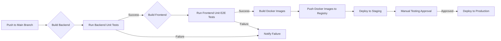

# GreaterWMS Repository CI/CD Analysis

This analysis examines the provided GreaterWMS repository content to assess its current CI/CD practices, identify automation opportunities, and recommend improvements.

## Current CI/CD Pipeline Configuration

The repository shows rudimentary CI/CD elements but lacks a fully defined pipeline.  There's no `.github/workflows` directory indicating the absence of GitHub Actions workflows or similar automated CI/CD processes.  The `Dockerfile` suggests a Docker-based deployment strategy, but the process for building and deploying the Docker image isn't automated.

## Build and Deployment Processes

The build process is partially defined:

* **Backend:** The `Dockerfile` outlines building the backend using a Python 3.8.10-slim base image.  Dependencies are installed using `pip3`.  A custom `backend_start.sh` script is used to launch the application.  This script is not included in the provided code.
* **Frontend:**  The frontend uses Node.js 14.19.3 and Quasar CLI.  A `package.json` file is present, indicating use of npm or yarn for dependency management.  A `web_start.sh` script (not included) is used to start the frontend.

Deployment is implied through the `Dockerfile` and `docker-compose` mention in the README, suggesting a Docker Compose setup. However, there's no `docker-compose.yml` file in the provided code.  The process of building the Docker images, pushing them to a registry, and deploying them to a server is not automated.

Manual steps are evident in the README, such as:

* Manually cloning the repository.
* Manually running `docker-compose up -d`.
* Manually changing the base URL in a text file.
* Manually running `docker-compose restart`.
* Manually running the backend and frontend development servers.

## Automation Opportunities

Significant automation opportunities exist:

* **Automated Builds:** Implement GitHub Actions or a similar CI system to automate the build process for both the backend and frontend. This would involve creating workflows to:
    * Clone the repository.
    * Build the Docker images.
    * Run unit and integration tests (see below).
    * Push the Docker images to a container registry (e.g., Docker Hub, Google Container Registry).
* **Automated Deployments:** Extend the CI workflows to automate deployment to a staging and production environment.  This might involve using tools like Kubernetes, Docker Swarm, or other orchestration platforms.
* **Automated Testing:** Integrate automated unit and integration tests into the build process.  This would provide a quality gate before deployment.
* **Infrastructure as Code (IaC):** Use IaC tools like Terraform or Ansible to manage the infrastructure (servers, networks, etc.). This would enable reproducible and automated infrastructure provisioning.
* **Environment Configuration:** Manage environment-specific configurations (database credentials, API keys, etc.) using environment variables or configuration management tools like Ansible or Vault.

## Quality Gates and Testing Integration

Currently, no automated testing is evident.  The README mentions the need to "Please google how to install Twisted", suggesting potential challenges and a lack of robust testing.

Recommendations:

* **Unit Tests:** Implement unit tests for both the backend (Python) and frontend (JavaScript/Vue).  Use testing frameworks like pytest (Python) and Jest (JavaScript).
* **Integration Tests:**  Implement integration tests to verify the interaction between the backend and frontend.
* **End-to-End (E2E) Tests:** Consider adding E2E tests to cover the entire application flow.  Cypress or Selenium could be used.
* **Code Coverage:** Track code coverage to ensure sufficient testing.

## Infrastructure as Code Practices

No IaC practices are apparent.  The deployment process relies on manual steps, making it difficult to reproduce environments consistently.

Recommendations:

* **Adopt IaC:** Use Terraform or Ansible to define and manage the infrastructure.  This will allow for automated provisioning and consistent environments across development, staging, and production.
* **Containerization:** Continue using Docker for containerizing the application. This improves portability and consistency.
* **Orchestration:** Consider using Kubernetes or Docker Swarm to manage and scale the application containers.

## CI/CD Workflow Recommendation

The following diagram illustrates a recommended CI/CD workflow using GitHub Actions:

## Optimizing CI/CD Workflows and Deployment Strategies

* **Modularize the Build:** Separate the backend and frontend builds into independent stages for better parallelization and error handling.
* **Continuous Integration:** Implement continuous integration to catch errors early in the development cycle.
* **Continuous Delivery/Deployment:** Implement continuous delivery or deployment to automate the release process.
* **Rollback Strategy:**  Implement a rollback strategy to quickly revert to a previous working version in case of production issues.
* **Monitoring and Logging:** Integrate monitoring and logging tools to track application performance and identify potential problems.

This analysis provides a starting point for improving the GreaterWMS CI/CD pipeline.  Implementing these recommendations will significantly enhance the development process, improve software quality, and enable faster and more reliable deployments.