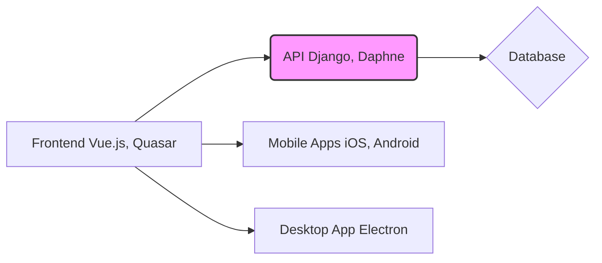

## GreaterWMS High-Level Design Document

This document provides a high-level design analysis of the GreaterWMS repository, based on the provided code snippets.  Due to the limited codebase provided, this analysis focuses on inferring the system architecture and design from the available information (README, Dockerfiles, and issue templates).  A complete analysis would require access to the full source code and database schema.

### 1. System Overview

GreaterWMS is a comprehensive inventory management system designed for warehouse operations. It supports multiple deployment methods (Docker, bare metal), multiple warehouses, supplier and customer management, and integrates with mobile (iOS, Android) and desktop (Electron) applications.  The system appears to be built using a microservice architecture with a Python (Django) backend and a Vue.js frontend.

### 2. Architecture

The system architecture is inferred to be a three-tier architecture:

* **Presentation Tier:**  A Quasar Framework (Vue.js) based frontend provides a user interface for interacting with the system. This tier is deployed separately and communicates with the backend API.  Mobile apps (iOS and Android) share the same frontend codebase, leveraging the Quasar framework's cross-platform capabilities.  A desktop application (Electron) is also available.

* **Application Tier:** A Django-based RESTful API serves as the application tier. This handles business logic, data access, and communication between the frontend and the database.  The `Dockerfile` indicates the use of `daphne` for handling WebSocket connections, suggesting real-time features like inventory updates.

* **Data Tier:** A relational database (likely PostgreSQL or MySQL, not specified) stores inventory data, supplier information, customer details, and other relevant information.  The exact database schema and data models are not available in the provided code.

### 3. Component Design

* **Backend (Django):**  Handles core business logic, including inventory management, order processing, supplier and customer management, and API endpoints.  The `backend_start.sh` script likely manages the Django application's startup and shutdown.

* **Frontend (Vue.js, Quasar):**  Provides the user interface for all platforms (web, mobile, desktop).  The `templates/` directory contains the frontend code.  `package.json` manages frontend dependencies.  `web_start.sh` likely manages the Quasar development server and build process.

* **Mobile Apps (Cordova):**  The mobile apps appear to be built using Cordova, leveraging the Quasar frontend codebase for cross-platform compatibility.

* **API:**  A RESTful API is used for communication between the frontend and backend.  The API documentation is mentioned but not provided.

### 4. API Documentation and Interfaces

The README mentions API documentation available at `baseurl + '/docs/'`, suggesting the use of a tool like Swagger or OpenAPI for documenting the API.  The specific endpoints and data formats are unknown without access to the full API code.

### 5. Database Schema and Data Models

The database schema and data models are not provided.  However, based on the system's functionality, we can infer the existence of tables for:

* **Warehouses:**  `warehouse_id`, `name`, `location`, etc.
* **Suppliers:** `supplier_id`, `name`, `contact`, etc.
* **Customers:** `customer_id`, `name`, `contact`, etc.
* **Products:** `product_id`, `name`, `description`, `unit_price`, etc.
* **Inventory:** `inventory_id`, `warehouse_id`, `product_id`, `quantity`, etc.
* **Orders:** `order_id`, `customer_id`, `product_id`, `quantity`, `order_date`, etc.

### 6. System Integration Patterns

* **Microservices:** The separate frontend and backend deployments suggest a microservice architecture.

* **RESTful API:**  The system uses a RESTful API for communication between the frontend and backend.

* **WebSocket:**  `daphne` suggests the use of WebSockets for real-time updates.

### 7. Recommendations

* **Detailed API Documentation:**  Provide comprehensive API documentation using a standard format like OpenAPI/Swagger.

* **Database Schema Design:**  Document the database schema and data models clearly.  Consider using a database modeling tool to create diagrams.

* **Deployment Automation:**  Implement automated deployment pipelines for both the frontend and backend using tools like Jenkins or GitLab CI/CD.

* **Security Considerations:**  Implement robust security measures, including authentication, authorization, and input validation.

* **Error Handling:**  Implement comprehensive error handling and logging throughout the system.

* **Testing:**  Implement a comprehensive testing strategy, including unit, integration, and end-to-end tests.

This high-level design analysis provides a starting point for understanding the GreaterWMS system.  A more detailed analysis would require access to the complete source code and database schema.
