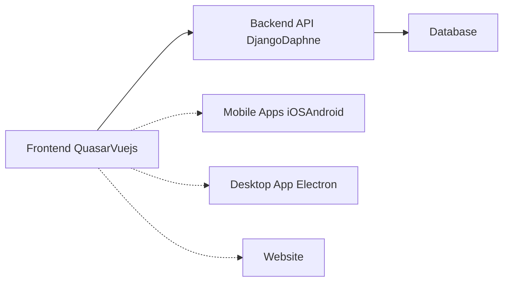

# GreaterWMS High-Level Design Analysis

This document provides a high-level design analysis of the GreaterWMS repository based on the provided code and documentation.  Due to the limited codebase provided, this analysis is based on inferences from the `README`, `Dockerfile`, and issue templates.  A more comprehensive analysis would require access to the full source code and database schema.

## 1. High-Level System Architecture

GreaterWMS is a multi-platform inventory management system designed for warehouse management. It employs a three-tier architecture:

* **Frontend:** A Quasar framework (Vue.js based) application deployed as a website, mobile apps (iOS and Android), and potentially a desktop application (Electron).  This tier handles user interaction, data display, and communication with the backend.

* **Backend:** A Django (Python) based RESTful API. This tier handles business logic, data processing, and database interactions.  It uses Daphne for WebSockets, enabling real-time updates.

* **Database:**  The specific database system is not explicitly stated, but it's likely a relational database (e.g., PostgreSQL, MySQL) given the nature of the application.

## 2. Low-Level Component Design (Inferred)

Based on the `README`, the system likely includes the following components:

* **Warehouse Management:**  Handles multiple warehouses, stock levels, and location tracking.
* **Supplier Management:** Manages supplier information, orders, and deliveries.
* **Customer Management:** Manages customer information and orders.
* **Order Management:** Processes orders, tracks shipments, and manages inventory adjustments.
* **Stock Control:**  Tracks inventory levels, manages stock replenishment, and generates reports.
* **Cycle Counting:**  Supports cycle counting processes for inventory accuracy.
* **Reporting & Analytics:**  Generates reports on inventory levels, order history, and other key metrics.
* **API Gateway:**  Handles requests from different clients (web, mobile, desktop).
* **Authentication & Authorization:**  Manages user authentication and access control.

## 3. API Documentation and Interfaces (Inferred)

The `README` mentions API documentation accessible at `baseurl + '/docs/'`.  This suggests a well-documented RESTful API with endpoints for various functionalities like:

* `/warehouses`:  CRUD operations for warehouses.
* `/suppliers`: CRUD operations for suppliers.
* `/customers`: CRUD operations for customers.
* `/orders`: CRUD operations for orders, including order placement, tracking, and updates.
* `/inventory`:  Get inventory levels, update stock levels, and manage stock adjustments.
* `/cyclecounts`:  Initiate and manage cycle counting processes.

## 4. Database Schema and Data Models (Inferred)

Without access to the database schema, we can only infer the likely data models:

* **Warehouse:** `id`, `name`, `location`, etc.
* **Supplier:** `id`, `name`, `contact`, `address`, etc.
* **Customer:** `id`, `name`, `contact`, `address`, etc.
* **Product:** `id`, `name`, `description`, `SKU`, `unit`, etc.
* **Inventory:** `id`, `warehouse_id`, `product_id`, `quantity`, `location`, etc.
* **Order:** `id`, `customer_id`, `order_date`, `status`, etc.
* **OrderItem:** `id`, `order_id`, `product_id`, `quantity`, etc.

## 5. System Integration Patterns

* **Mobile App Integration:**  The mobile apps likely communicate with the backend API using RESTful calls.  The use of a scanner suggests integration with barcode/QR code scanning libraries.
* **Desktop App Integration:**  Similar to mobile apps, the desktop app (if implemented using Electron) would interact with the backend API via RESTful calls.
* **Third-Party Integrations:**  The system might integrate with other systems (e.g., ERP, accounting software) via APIs.  This aspect is not detailed in the provided information.

## 6. Recommendations

* **Detailed Documentation:**  Expand the API documentation to include detailed specifications for each endpoint, including request/response formats, authentication methods, and error handling.
* **Database Design:**  Provide a detailed database schema with ER diagrams to illustrate relationships between tables and data models.
* **Technology Stack Clarification:**  Specify the exact versions of all technologies used (database, Python libraries, etc.) in a central location.
* **Security Considerations:**  Address security aspects such as authentication, authorization, data encryption, and input validation.
* **Deployment Strategy:**  Document the deployment process in detail, including steps for setting up the environment, configuring the server, and deploying the application.
* **Testing Strategy:**  Outline a comprehensive testing strategy covering unit, integration, and system testing.

This high-level design analysis provides a foundational understanding of the GreaterWMS system.  Further analysis would require access to the complete source code and database schema for a more detailed and accurate assessment.