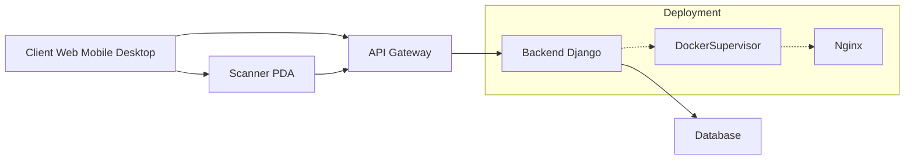

# GreaterWMS High-Level Design Analysis

This document provides a high-level design analysis of the GreaterWMS repository based on the provided code snippets.  Due to the limited codebase provided, this analysis is incomplete and relies on inferences from the `README`, `Dockerfile`, and issue templates.  A full analysis would require access to the complete source code and database schema.

## 1. High-Level System Architecture

GreaterWMS appears to be a three-tier architecture:

* **Client Tier:**  Offers multiple interfaces (web, mobile Android/iOS, and desktop Electron app).  The mobile app utilizes Cordova for cross-platform development.
* **API Gateway Tier:**  Handles requests from various clients, routing them to the appropriate backend services.  Details about the gateway itself are not provided.
* **Backend Tier (Django):**  Implements the core business logic using Python and the Django framework.  It interacts with the database and provides the API for the clients.  Uses Daphne for ASGI (Asynchronous Server Gateway Interface) support.
* **Database Tier:**  Stores inventory data, supplier information, customer details, and other relevant data. The specific database system is not specified.
* **Scanner PDA:**  Directly interacts with the API Gateway for real-time data entry.

## 2. Low-Level Component Design

Based on the `README`, key components include:

* **Warehouse Management:**  Handles multiple warehouses, stock control, cycle counting, and safety stock management.
* **Supplier Management:**  Manages supplier information and relationships.
* **Customer Management:**  Manages customer information and orders.
* **Order Management:**  Processes orders, tracks shipments, and manages order fulfillment.
* **API:**  Provides RESTful APIs for client interaction.  The API documentation is mentioned but not provided.
* **Authentication & Authorization:**  Mechanism for user authentication and authorization is not detailed in the provided code.

## 3. API Documentation and Interfaces

The `README` mentions API documentation, but no specification is provided.  We can infer that the API is RESTful, given the common web development practices.  A full API specification (using OpenAPI/Swagger, for example) is needed for a complete analysis.

## 4. Database Schema and Data Models

The database schema and data models are not provided.  However, based on the features listed, we can infer the existence of tables for:

* **Warehouses:**  `warehouse_id`, `name`, `location`, etc.
* **Suppliers:**  `supplier_id`, `name`, `contact`, etc.
* **Customers:**  `customer_id`, `name`, `contact`, etc.
* **Products:**  `product_id`, `name`, `description`, `unit_price`, etc.
* **Inventory:**  `warehouse_id`, `product_id`, `quantity`, etc.
* **Orders:**  `order_id`, `customer_id`, `order_date`, `status`, etc.
* **Order Items:**  `order_id`, `product_id`, `quantity`, etc.

A detailed Entity-Relationship Diagram (ERD) is needed for a comprehensive understanding.

## 5. System Integration Patterns

* **Mobile App Integration:**  Uses Cordova for cross-platform development and interacts with the backend via REST APIs.
* **Scanner PDA Integration:**  Directly interacts with the API Gateway for real-time data input.
* **Docker Integration:**  The application is designed to be containerized using Docker, simplifying deployment and management.
* **Supervisor Integration:**  Uses Supervisor for process management, ensuring the backend services run reliably.
* **Nginx Integration:**  Likely used as a reverse proxy and load balancer in production.

## 6. Recommendations

* **Provide complete source code and database schema:** This is crucial for a thorough analysis.
* **Document the API using OpenAPI/Swagger:** This will allow for better understanding and integration with other systems.
* **Create a detailed ERD:**  This will clarify the database design and relationships between entities.
* **Document authentication and authorization mechanisms:** This is essential for security.
* **Provide more details on the API Gateway:**  Its functionality and configuration should be documented.
* **Specify the database system:**  Knowing the database system (e.g., PostgreSQL, MySQL) will aid in optimization and performance tuning.
* **Improve the Dockerfile:**  The Dockerfile uses Aliyun mirrors. While this might be beneficial for faster downloads in China, it's not ideal for global users. Consider using a more generic approach or providing options for different mirror sources.

This analysis provides a starting point for understanding the GreaterWMS system.  A more comprehensive analysis requires access to the complete source code and detailed documentation.