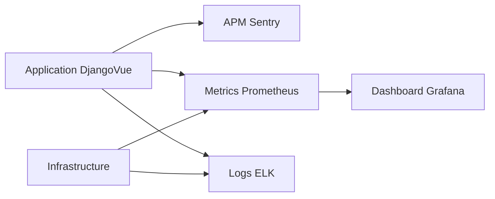

# GreaterWMS Repository Monitoring Analysis

This analysis assesses the GreaterWMS repository's current monitoring and observability setup, identifying gaps and recommending improvements.  The analysis is based solely on the provided code snippets; a full assessment would require access to the complete repository and deployed infrastructure.

## Current Monitoring and Observability Setup

Based on the provided files, the current monitoring setup appears rudimentary.  There's no explicit mention of centralized monitoring tools like Prometheus, Grafana, Datadog, or similar.  The reliance on manual checks and potentially log file analysis suggests a lack of automated monitoring and alerting.

The `Dockerfile` indicates a deployment strategy using Docker, which provides a foundation for containerized monitoring. However, no monitoring agents or sidecar containers are evident within the Dockerfiles.

## Logging Patterns and Strategies

The provided code doesn't reveal specific logging implementations.  Best practices suggest using a structured logging library (e.g., `loguru` or `structlog` for Python, `winston` for Node.js) to generate logs with consistent formats, including timestamps, severity levels, and relevant context.  This facilitates efficient log analysis and filtering.

**Recommendation:** Implement structured logging in both the backend (Python) and frontend (Node.js) components.  Consider using a centralized logging solution (e.g., Elasticsearch, Fluentd, Logstash, Kibana - the ELK stack) for aggregation and analysis.

## Performance Monitoring Capabilities

No explicit performance monitoring tools or libraries are identified in the provided code.  This means there's likely a lack of real-time performance metrics such as request latency, CPU usage, memory consumption, and database query times.

**Recommendation:** Integrate performance monitoring tools. For the backend (Django), consider using libraries like Django Debug Toolbar during development and integrating with Prometheus or similar for production. For the frontend (Vue.js), browser developer tools offer basic performance insights, but dedicated tools like Lighthouse or performance monitoring services are recommended for production.

## Error Tracking and Alerting Systems

The repository includes issue templates for bug reports, indicating a manual error tracking process.  However, there's no automated error tracking or alerting system.  This means errors might go unnoticed until reported by users.

**Recommendation:** Implement an automated error tracking system.  For the backend, integrate with a service like Sentry or Rollbar.  For the frontend, consider using Sentry or a similar service that captures JavaScript errors and provides detailed stack traces.  Configure alerts for critical errors.

## Metrics Collection and Dashboards

The absence of monitoring tools implies a lack of automated metrics collection and dashboards.  Key metrics such as user activity, inventory levels, order processing times, and system resource utilization are likely not being tracked.

**Recommendation:**  Implement a metrics collection system using Prometheus or similar.  Define relevant metrics and create dashboards in Grafana to visualize them.  This allows for proactive identification of performance bottlenecks and potential issues.

## Comprehensive Monitoring and Observability Recommendations

To implement comprehensive monitoring and observability, consider the following:

1. **Centralized Monitoring:** Choose a centralized monitoring solution (e.g., Prometheus, Grafana, Datadog, New Relic) to collect and visualize metrics from all components.

2. **Structured Logging:** Implement structured logging in both backend and frontend applications.  Use a centralized logging solution for aggregation and analysis.

3. **Application Performance Monitoring (APM):** Integrate APM tools (e.g., Sentry, New Relic, Datadog) to track application performance, identify slow requests, and detect errors.

4. **Infrastructure Monitoring:** Monitor infrastructure metrics (CPU, memory, disk I/O, network) using tools like Prometheus, cAdvisor (for Docker containers), or cloud provider monitoring services.

5. **Alerting:** Configure alerts for critical errors, performance degradation, and other significant events.  Use email, Slack, PagerDuty, or other notification channels.

6. **Tracing:** Implement distributed tracing (e.g., Jaeger, Zipkin) to track requests across multiple services and identify performance bottlenecks.

7. **Dashboards:** Create dashboards to visualize key metrics and provide a comprehensive overview of the system's health and performance.

8. **Docker Monitoring:**  Include monitoring agents or sidecar containers within your Docker images to collect metrics and logs directly from the containers.

## Mermaid Diagram (Illustrative Example)

This diagram illustrates a potential monitoring architecture.  Note that this is a simplified example and the specific tools and integrations will depend on your chosen monitoring solution.

This improved monitoring setup will provide significantly better visibility into the GreaterWMS system's health, performance, and error rates, enabling proactive issue resolution and improved user experience.