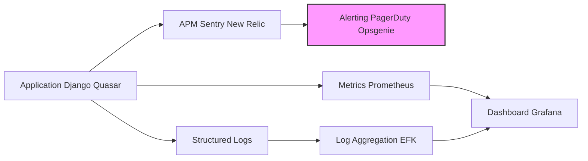

# GreaterWMS Repository Monitoring Analysis

This analysis assesses the GreaterWMS repository's current monitoring and observability setup based on the provided code snippets.  The analysis focuses on logging, performance monitoring, error tracking, alerting, and metrics collection.  Recommendations for improvement are also provided.

## Current Monitoring and Observability Setup

Based on the provided code, the GreaterWMS project lacks a dedicated, comprehensive monitoring and observability solution.  The `Dockerfile` suggests a deployment using Docker, which offers some basic monitoring capabilities through Docker stats and logs. However, these are insufficient for a production-ready application.  There is no evidence of integration with dedicated monitoring tools like Prometheus, Grafana, Datadog, or similar.

## Logging Patterns and Strategies

The repository doesn't directly showcase logging configurations.  However, the presence of a backend (`backend_start.sh`) and frontend (`web_start.sh`) suggests that logging mechanisms should be implemented within the Python (Django) and Node.js (Quasar) applications.  Without seeing the code for these applications, it's impossible to determine the specific logging strategy used (e.g., structured logging, log levels).

**Recommendation:** Implement structured logging using a standard library like Python's `logging` module or a dedicated logging library such as `loguru` for the backend and a similar approach for the frontend (e.g., Winston, Pino).  Ensure logs include timestamps, log levels (DEBUG, INFO, WARNING, ERROR, CRITICAL), and relevant context (e.g., request IDs, user IDs).  Consider using a centralized logging system like Elasticsearch, Fluentd, and Kibana (EFK) stack or similar for aggregation and analysis.

## Performance Monitoring Capabilities

No explicit performance monitoring tools are identified in the provided code.  While Docker provides basic resource usage metrics, these are insufficient for application-level performance insights.  The absence of dedicated performance monitoring tools means there's no way to track response times, request rates, database query performance, or other critical performance indicators.

**Recommendation:** Integrate a dedicated application performance monitoring (APM) tool.  For the backend (Django), consider tools like Sentry, New Relic, or Jaeger.  For the frontend (Quasar), tools like Sentry or browser developer tools can be used.  These tools provide detailed performance metrics, traces, and profiling capabilities.

## Error Tracking and Alerting Systems

The repository includes issue templates for bug reports, indicating a basic error tracking mechanism.  However, this is reactive and doesn't provide proactive alerting.  There's no mention of error tracking services or alerting systems.

**Recommendation:** Integrate an error tracking service like Sentry or Rollbar. These services automatically capture exceptions, provide detailed error reports, and can be configured to send alerts based on error frequency or severity.  Implement alerting mechanisms for critical errors, such as database connection failures, high error rates, or significant performance degradation.  Consider using tools like PagerDuty or Opsgenie to manage and route alerts.

## Metrics Collection and Dashboards

No metrics collection or dashboarding solutions are apparent.  Without these, it's difficult to track key performance indicators (KPIs) and gain insights into application behavior.

**Recommendation:** Implement a metrics collection system using Prometheus or similar.  Expose relevant metrics from the backend (Django) and frontend (Quasar) applications.  Use Grafana or a similar dashboarding tool to visualize these metrics and create dashboards for monitoring key performance indicators (KPIs).  Examples of metrics to collect include:

* **Backend:** Request latency, request rate, error rate, database query time, CPU usage, memory usage.
* **Frontend:** Page load time, JavaScript error rate, user engagement metrics.

##  Monitoring Architecture Recommendation

The following diagram illustrates a recommended monitoring architecture:

This architecture incorporates structured logging, APM for performance insights, alerting for critical issues, and metrics collection and dashboards for proactive monitoring.

## Conclusion

The GreaterWMS repository currently lacks a comprehensive monitoring and observability strategy.  Implementing the recommendations above will significantly improve the project's reliability, maintainability, and operational efficiency.  This will enable proactive identification and resolution of issues, leading to a more robust and user-friendly application.