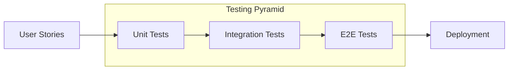

# GreaterWMS Repository TDD Analysis

Based on the provided repository content, a comprehensive TDD analysis cannot be performed.  The codebase itself is missing, and there is no evidence of any tests within the provided files.  The analysis will therefore focus on identifying opportunities for TDD implementation and making recommendations based on best practices.

## Current Test Coverage and Quality

**Current Status:**  Zero. No tests were found in the provided files.

**Quality:** N/A.  Since no tests exist, there's no quality to assess.

## Test-Driven Development Practices

**Current Status:** Not implemented. The absence of tests indicates that TDD was not a part of the development process.

**Recommendations:**

1. **Embrace TDD:**  Implement a TDD workflow where tests are written *before* the code they are intended to verify. This "red-green-refactor" cycle ensures that code is written to meet specific requirements and reduces the likelihood of bugs.

2. **Start Small:** Begin by selecting a small, well-defined module or feature. Write unit tests first, focusing on individual functions or classes.  Then, write the minimal code necessary to pass the tests.

3. **Incremental Development:** Gradually expand test coverage by adding more tests for different scenarios and edge cases.  This iterative approach allows for continuous integration and early detection of issues.

4. **Prioritize Critical Paths:** Focus on testing core functionalities and critical paths first.  This ensures that the most important parts of the application are thoroughly tested.

## Testing Frameworks and Patterns

**Current Status:** None identified.

**Recommendations:**

* **Python (Backend):**  Use `pytest` or `unittest` for unit and integration testing of the Django backend.  `pytest` is generally preferred for its ease of use and extensive plugin ecosystem.  Consider using mocking libraries like `unittest.mock` or `pytest-mock` to isolate units under test.

* **JavaScript (Frontend):** For the Quasar frontend (Vue.js), utilize `Jest` or `Vitest` for unit testing of components and functions.  `Vue Test Utils` provides helpful utilities for testing Vue components.  For end-to-end testing, consider `Cypress` or `Playwright`.

* **Testing Patterns:** Employ various testing patterns such as:
    * **Arrange-Act-Assert:** Structure tests clearly by separating setup (arrange), execution (act), and verification (assert) steps.
    * **Data-driven testing:** Use parameterized tests to run the same test logic with different input data.
    * **Test doubles (mocks, stubs, spies):** Isolate units under test by replacing dependencies with controlled substitutes.

## Unit, Integration, and End-to-End Testing Strategies

**Current Status:** No testing strategy is evident.

**Recommendations:**

* **Unit Tests:** Test individual components (functions, classes) in isolation.  High unit test coverage is crucial for maintainability and refactoring.

* **Integration Tests:** Verify the interaction between different modules or components. This helps catch integration issues that might not be apparent in unit tests.

* **End-to-End (E2E) Tests:** Test the entire application flow from start to finish, simulating user interactions.  E2E tests are essential for ensuring the application works as expected in a real-world scenario.

## Test Maintainability and Reliability

**Current Status:** N/A.

**Recommendations:**

* **Clear and Concise Tests:** Write tests that are easy to understand and maintain.  Use descriptive names and keep tests focused on a single aspect of the code.

* **Avoid Test Duplication:**  Refactor tests to avoid redundant code.  Use helper functions or fixtures to share common setup or teardown logic.

* **Continuous Integration (CI):** Integrate tests into a CI/CD pipeline to automatically run tests on every code change.  This helps catch bugs early and ensures that the codebase remains stable.

* **Code Coverage Tools:** Use code coverage tools (like `pytest-cov` for Python) to track test coverage and identify areas that need more testing.  Aim for high coverage, but remember that code coverage is not a substitute for good test design.

##  Diagram of Recommended Testing Strategy

This diagram illustrates a testing pyramid, emphasizing the importance of a strong foundation of unit tests, complemented by a smaller number of integration and E2E tests.

In conclusion, the GreaterWMS project lacks any apparent TDD implementation.  The recommendations above provide a roadmap for integrating TDD into the development process, leading to a more robust, maintainable, and reliable application.  The immediate priority should be to add a comprehensive testing suite using appropriate frameworks and patterns.