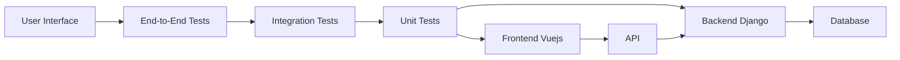

# GreaterWMS Repository TDD Analysis

Based on the provided repository content, a comprehensive TDD analysis is impossible due to the absence of any test files or explicit mention of testing frameworks or strategies.  The repository showcases a project structure, build instructions, and documentation, but lacks the crucial component of tests.  This indicates that Test-Driven Development (TDD) is not currently implemented.

## Current State of TDD

* **Test Coverage:** 0% - No test files are present in the provided codebase.
* **TDD Practices:** Not implemented - The codebase shows no evidence of TDD practices.  The `Dockerfile` and build instructions focus solely on deployment and execution, not testing.
* **Testing Frameworks:** None used - No testing frameworks (e.g., pytest, unittest for Python; Jest, Mocha for JavaScript) are mentioned or detected.
* **Testing Strategies:**  None implemented - There's no indication of unit, integration, or end-to-end testing strategies.
* **Test Maintainability and Reliability:** N/A -  Without tests, there's nothing to assess for maintainability and reliability.


## Recommendations for Improving TDD Practices

To improve the GreaterWMS project and incorporate TDD, the following steps are recommended:

1. **Introduce a Testing Framework:** Choose a suitable testing framework for both the backend (Python/Django) and frontend (Vue.js).  For Python/Django, `pytest` is a popular and powerful choice. For Vue.js, `Jest` or `Cypress` are common options.

2. **Start with Unit Tests:** Begin by writing unit tests for individual components and functions.  This ensures that the smallest building blocks of the application function correctly in isolation.  Focus on core logic within the backend (models, views, business logic) and frontend (components, utilities).

3. **Implement Integration Tests:** After establishing solid unit test coverage, proceed to integration tests. These tests verify the interaction between different components and modules.  For example, test the interaction between Django views and models, or between Vue.js components.

4. **Design End-to-End Tests (Optional):**  Consider adding end-to-end tests to cover the entire application flow.  These tests simulate user interactions and validate the overall system behavior.  Tools like Cypress can be effective for this.

5. **Embrace TDD Cycle:**  Strictly adhere to the TDD cycle:
    * **Red:** Write a failing test that defines a specific requirement or functionality.
    * **Green:** Write the minimal amount of code necessary to pass the test.
    * **Refactor:** Improve the code's design and structure while ensuring the tests continue to pass.

6. **Structure Tests:** Organize tests into logical directories and files, mirroring the project structure.  Use descriptive test names that clearly communicate the tested functionality.

7. **Continuous Integration:** Integrate testing into a CI/CD pipeline.  This ensures that tests are run automatically with every code change, preventing regressions and maintaining code quality.

8. **Code Coverage Analysis:** Use code coverage tools (e.g., `coverage.py` for Python) to track the percentage of code covered by tests.  Aim for high coverage (ideally 80% or more) to ensure comprehensive testing.

9. **Test Documentation:**  Document the testing strategy and approach, including the rationale behind test selection and the expected coverage levels.


## Example Test Structure (Python/pytest)

Let's assume a simple Django model for a `Product`:

```python
# models.py
from django.db import models

class Product(models.Model):
    name = models.CharField(max_length=255)
    price = models.DecimalField(max_digits=10, decimal_places=2)
```

A corresponding pytest unit test might look like this:

```python
# tests/test_models.py
import pytest
from .models import Product

def test_product_creation():
    product = Product.objects.create(name="Test Product", price=19.99)
    assert product.name == "Test Product"
    assert product.price == 19.99
```


##  Diagram Illustrating Testing Layers (Mermaid)



This diagram illustrates the different testing layers and their relationships.  End-to-end tests cover the entire application flow, while integration tests focus on interactions between components, and unit tests verify individual units of code.


This analysis highlights the critical need for incorporating TDD into the GreaterWMS project.  The recommendations provided will guide the development team in implementing a robust testing strategy, leading to improved code quality, reduced bugs, and increased maintainability.